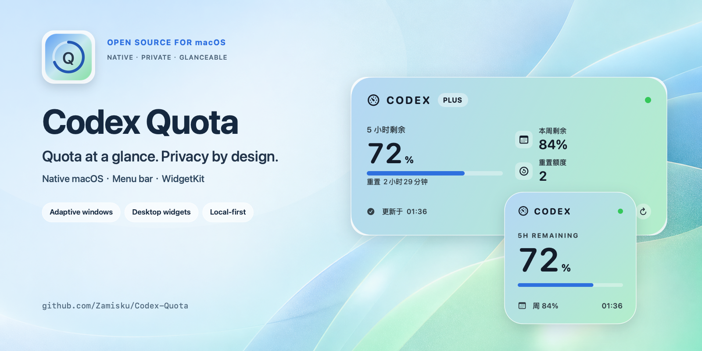
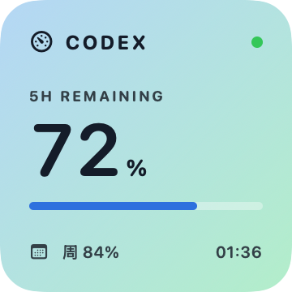
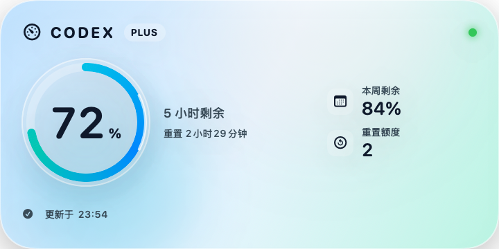
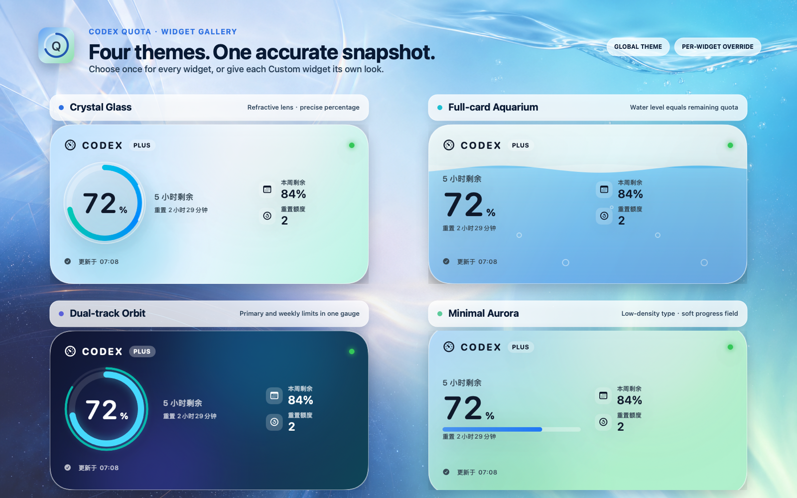
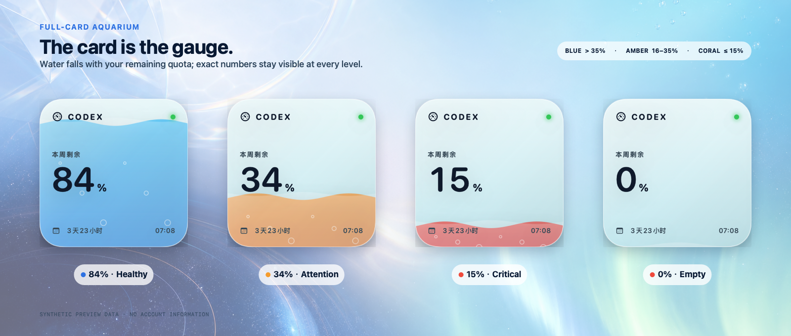

# Codex Quota

<p align="center">
  
</p>

<p align="center">
  <strong>Quota at a glance. Privacy by design.</strong><br>
  A native macOS menu bar companion and WidgetKit dashboard for local Codex quota.
</p>

<p align="center">
  <a href="README.zh-CN.md">简体中文</a>
  ·
  <a href="https://github.com/Zamisku/Codex-Quota/releases/latest"></a>
  ·
  <a href="https://github.com/Zamisku/Codex-Quota/actions/workflows/ci.yml"></a>
  
  
  <a href="LICENSE"></a>
</p>

<p align="center">
  <a href="#install">Install</a>
  ·
  <a href="#privacy-model">Privacy</a>
  ·
  <a href="docs/ARCHITECTURE.md">Architecture</a>
  ·
  <a href="CONTRIBUTING.md">Contributing</a>
</p>

> [!TIP]
> Is Codex Quota useful in your workflow? [Star the project on GitHub](https://github.com/Zamisku/Codex-Quota) to help more Codex users discover it.

Codex Quota keeps your current weekly quota visible before a limit interrupts your flow. If Codex restores a shorter rolling window, the app detects it from the response and automatically presents it alongside the weekly quota. The native SwiftUI host reads the existing local Codex Desktop sign-in, fetches quota information from fixed ChatGPT compatibility endpoints, and shares only a sanitized snapshot with its sandboxed widget extension. It never stores the access token in the App Group.

> [!IMPORTANT]
> Codex Quota is an unofficial community project and is not affiliated with or endorsed by OpenAI. The quota endpoints it relies on are internal compatibility endpoints, not a stable public API, and may change without notice.

## Why Codex Quota

- Native SwiftUI menu bar app with Small and Medium WidgetKit widgets.
- Four built-in widget themes: Crystal Glass, Full-card Aquarium, Dual-track Orbit, and Minimal Aurora.
- A global theme for existing widgets plus a configurable widget whose individual instances can override it.
- Displays the current weekly quota, reset time, plan, and reset credits when available.
- Automatically adds a returned short rolling window without requiring another UI or data migration.
- Automatic background refresh with stale-data fallback and clear failure states.
- Manual refresh from the app, menu bar, or widget deep link.
- Optional launch-at-login support through `SMAppService`.
- Universal `arm64` and `x86_64` Release builds.
- No analytics, telemetry, cookies, redirects, or third-party tracking.
- The widget is sandboxed and cannot read `~/.codex` or make authenticated network requests.
- Native Liquid Glass controls on macOS 26, with a matching standard-material fallback on macOS 14 and 15.

## Built for a glance

<p align="center">
  
  &nbsp;&nbsp;
  
</p>

Small shows the most time-sensitive quota currently returned by the service (weekly today). Medium adds reset credits and the next reset time without turning the desktop into another dashboard. The checked-in Crystal Glass previews intentionally use synthetic dual-window data to exercise the short-window compatibility path; they contain no account data.

## Four themes, two ways to choose

<p align="center">
  
</p>

The gallery is rendered from the same shared SwiftUI views used by WidgetKit, using synthetic 72% short-window and 84% weekly values. The surrounding artwork is promotional; the percentages, water level, orbit tracks, labels, and metrics are real project output.

| Theme | Visual language |
| --- | --- |
| **Crystal Glass** | A refractive lens gauge with a precise central percentage; the default. |
| **Full-card Aquarium** | The whole card becomes a tank whose water level equals the remaining quota. |
| **Dual-track Orbit** | A bold primary orbit and, when available, a thinner second quota track. |
| **Minimal Aurora** | Low-density typography, a progress band, and a softly shifting blue-green field. |

Open **Widget appearance** beside “Add to Desktop” to preview every theme in real Small and Medium layouts. The original **Codex Quota** widget keeps its existing WidgetKit kind and follows this global theme, so installed widgets survive an upgrade. Add **Codex Quota · Custom** when one widget instance should follow the app or independently use any of the four themes.

### Aquarium water-level semantics

<p align="center">
  
</p>

The Aquarium does not replace the exact number: it adds a full-card spatial cue. Above 35% the water is cyan-blue, 16–35% uses amber, and 15% or below uses coral red. At 0%, the tank visibly drains while the status text remains present.

## Requirements

- macOS 14 Sonoma or later
- Codex Desktop already signed in, with `${CODEX_HOME:-~/.codex}/auth.json` available
- No Xcode, XcodeGen, Apple Developer account, or source checkout required

## Install

### Download the app

[Download the latest DMG](https://github.com/Zamisku/Codex-Quota/releases/latest/download/Codex-Quota-macOS-universal.dmg), open it, and drag **Codex Quota** into **Applications**. The release is Universal and runs natively on Apple silicon and Intel Macs.

> [!NOTE]
> The current prebuilt release is Apple Development-signed but not yet notarized. On first launch from Finder, Control-click **Codex Quota**, choose **Open**, then confirm **Open** once. This limitation disappears when the maintainer's Developer ID and notarization secrets are configured.

### One-command install or update

```bash
curl -fsSL https://raw.githubusercontent.com/Zamisku/Codex-Quota/main/scripts/install-release.sh | /bin/zsh
```

This path requires only standard macOS tools. It downloads the latest GitHub Release ZIP, verifies its published SHA-256, code signature, host and widget Bundle IDs, backs up an existing installation, installs to `/Applications/Codex Quota.app`, registers the widget, and launches the app. Review the [installer source](scripts/install-release.sh) before running it if desired.

### First run

After the host app reports that a sanitized snapshot has been shared:

1. Control-click an empty area of the desktop.
2. Choose **Edit Widgets**.
3. Search for **Codex Quota**.
4. Add **Codex Quota** for the global theme, or **Codex Quota · Custom** for a per-widget override, in Small or Medium.

## Privacy model

```text
~/.codex/auth.json
        │ host app only
        ▼
Fixed HTTPS quota endpoints on chatgpt.com
        │ parsed and sanitized
        ▼
ProviderSnapshot in the signed App Group
        │ no token, account ID, prompts, or raw response
        ▼
Sandboxed WidgetKit extension
```

The host reads the local Codex authentication file because macOS does not grant a sandboxed process access to it. The widget stays sandboxed and receives only bounded Codable values. See [docs/PRIVACY.md](docs/PRIVACY.md) for the complete data-flow and threat-boundary notes.

## Architecture

| Area | Responsibility |
| --- | --- |
| `Codex-Quota/` | SwiftUI host window, menu bar UI, refresh loop, launch-at-login control |
| `CodexQuotaWidget/` | Sandboxed static and configurable Small/Medium WidgetKit definitions |
| `SharedUI/` | Shared four-theme renderer used by widgets and the in-app gallery |
| `Core/` | Authentication loading, fixed-endpoint networking, defensive parsing, shared snapshot model |
| `Codex-QuotaTests/` | Parser, stale-snapshot, theme fallback, and widget-kind regression tests |
| `project.yml` | XcodeGen source of truth for targets, signing, capabilities, and schemes |
| `scripts/install-release.sh` | Xcode-free verified installer for the latest GitHub Release |
| `scripts/package-release.sh` | Universal ZIP/DMG packaging, validation, and optional notarization |
| `scripts/build-install.sh` | Contributor-only local build and deployment workflow |
| `scripts/render-promo.swift` | Reproducible AppKit compositor for README and GitHub promotional artwork |
| `scripts/render-theme-assets.sh` | Renders all four real SwiftUI themes into the bilingual gallery, water-level strip, and social preview |

More detail is available in [docs/ARCHITECTURE.md](docs/ARCHITECTURE.md).

## Development

End users do not need this section. Contributors need Xcode 26 or later, [XcodeGen](https://github.com/yonaskolb/XcodeGen), and their own signing configuration for WidgetKit/App Group testing. See [CONTRIBUTING.md](CONTRIBUTING.md) before changing signing identifiers.

Generate the project:

```bash
xcodegen generate
```

Run the CI-compatible test command without signing:

```bash
xcodebuild \
  -project Codex-Quota.xcodeproj \
  -scheme Codex-Quota \
  -configuration Debug \
  -destination "platform=macOS,arch=$(uname -m)" \
  -derivedDataPath .build/CI \
  CODE_SIGNING_ALLOWED=NO \
  ONLY_ACTIVE_ARCH=YES \
  ARCHS="$(uname -m)" \
  test
```

For a signed local Release build and installation, use `./scripts/build-install.sh`.

Release maintainers should follow [docs/RELEASING.md](docs/RELEASING.md).

## Known limitations

- WidgetKit controls refresh scheduling; exact refresh times are not guaranteed.
- Quota response fields may change because the upstream endpoints are not public API contracts.
- The current prebuilt release is not notarized, so Finder requires the one-time Control-click **Open** flow. The verified command-line installer avoids any Xcode workflow while production notarization is being configured.
- Visual screenshots cannot establish full VoiceOver, keyboard, or Dynamic Type compliance; accessibility improvements are welcome.

## Community and support

- Read [CONTRIBUTING.md](CONTRIBUTING.md) before opening a pull request.
- Use [GitHub Issues](https://github.com/Zamisku/Codex-Quota/issues) for reproducible bugs and feature requests.
- Follow [SECURITY.md](SECURITY.md) for private vulnerability reports.
- See [SUPPORT.md](SUPPORT.md) for troubleshooting boundaries.
- Project changes are tracked in [CHANGELOG.md](CHANGELOG.md).

## License

Codex Quota is licensed under the [Apache License 2.0](LICENSE). Copyright notices are provided in [NOTICE](NOTICE), and third-party attribution is listed in [THIRD_PARTY_NOTICES.md](THIRD_PARTY_NOTICES.md).
