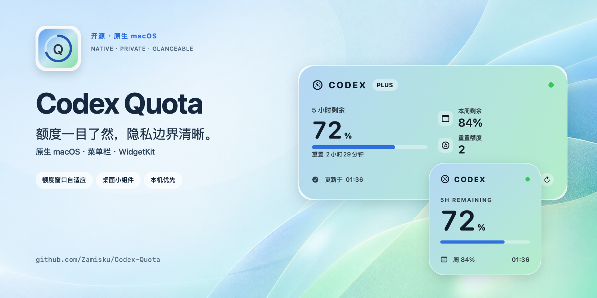
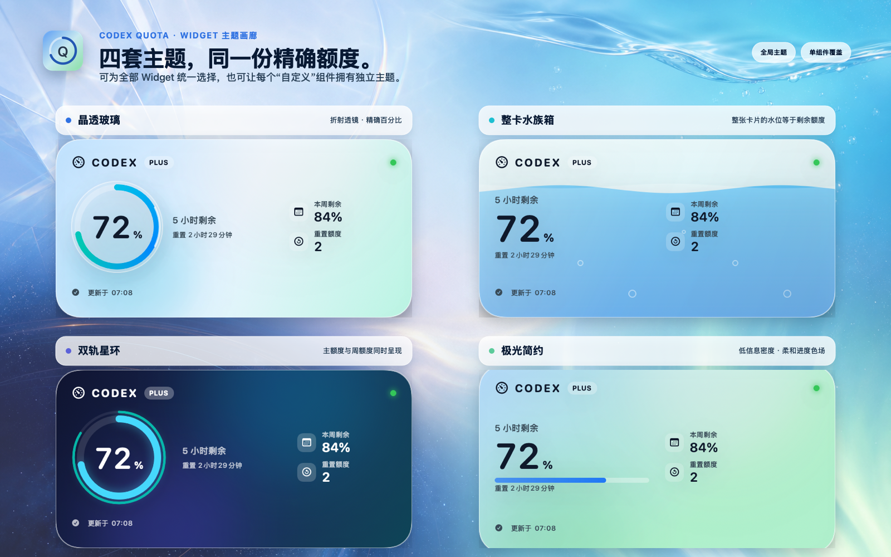
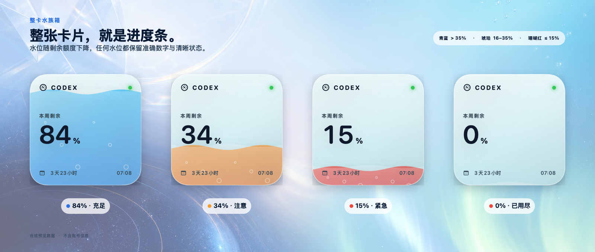

# Codex Quota

<p align="center">
  
</p>

<p align="center">
  <strong>额度一目了然，隐私边界清晰。</strong><br>
  用原生 macOS 菜单栏应用与 WidgetKit 小组件随时查看本机 Codex 额度。
</p>

<p align="center">
  <a href="README.md">English</a>
  ·
  <a href="https://github.com/Zamisku/Codex-Quota/releases/latest"></a>
  ·
  <a href="https://github.com/Zamisku/Codex-Quota/actions/workflows/ci.yml"></a>
  
  
  <a href="LICENSE"></a>
</p>

<p align="center">
  <a href="#安装">安装</a>
  ·
  <a href="#隐私边界">隐私说明</a>
  ·
  <a href="docs/ARCHITECTURE.md">项目架构</a>
  ·
  <a href="CONTRIBUTING.md">参与贡献</a>
</p>

> [!TIP]
> Codex Quota 对你的工作流有帮助？欢迎在 [GitHub 点一个 Star](https://github.com/Zamisku/Codex-Quota)，帮助更多 Codex 用户发现这个项目。

Codex Quota 把当前的每周额度放在桌面上一眼可见的位置，让你在限制打断工作流之前提前安排任务。如果 Codex 以后恢复更短的滚动窗口，应用会根据响应自动识别，并与每周额度一起展示。原生 SwiftUI 宿主读取 Codex Desktop 已有的本机登录状态，通过固定的 ChatGPT 兼容端点获取额度信息，再把不含令牌的脱敏快照共享给沙盒化的小组件扩展。访问令牌不会写入 App Group。

> [!IMPORTANT]
> Codex Quota 是非官方社区项目，与 OpenAI 没有隶属或背书关系。项目使用的是内部兼容端点，并非稳定的公开 API，接口可能随时变化。

## 为什么选择 Codex Quota

- 原生 SwiftUI 菜单栏应用，提供 Small 和 Medium 两种 WidgetKit 小组件。
- 内置“晶透玻璃、整卡水族箱、双轨星环、极光简约”四套小组件主题。
- 已有小组件使用全局主题，可配置小组件的每个实例还可独立覆盖主题。
- 显示当前每周额度、重置时间、套餐和 reset credits（可用时）。
- 上游重新返回短周期额度时自动增加展示，无需再次迁移界面或快照数据。
- 自动刷新，网络异常时保留近期快照并明确标记旧数据。
- 支持应用窗口、菜单栏和小组件深链手动刷新。
- 通过 `SMAppService` 可选启用登录时启动。
- Release 同时支持 `arm64` 与 `x86_64`。
- 不包含分析、遥测、Cookie、重定向或第三方跟踪。
- Widget Extension 启用沙盒，不能读取 `~/.codex`，也不能发起带认证的网络请求。
- macOS 26 使用原生 Liquid Glass 功能控件，macOS 14/15 自动降级为同布局的标准材质。

## 一眼掌握额度

<p align="center">
  
  &nbsp;&nbsp;
  
</p>

Small 只保留上游当前返回的最紧迫额度（目前为每周额度）；Medium 进一步展示 reset credits 和下一次重置时间，同时避免把桌面变成复杂仪表盘。仓库中的“晶透玻璃”预览图刻意使用合成的双窗口数据来覆盖短周期兼容路径，不包含任何账号数据。

## 四套主题，两种选择方式

<p align="center">
  
</p>

画廊直接复用 WidgetKit 使用的同一套共享 SwiftUI 视图，并以合成的 72% 短周期额度和 84% 周额度渲染。外围是宣传排版；百分比、水位、双轨、标签和指标均来自项目真实代码。

| 主题 | 视觉表达 |
| --- | --- |
| **晶透玻璃** | 折射透镜式进度环，中央保留精确百分比；默认主题。 |
| **整卡水族箱** | 整张卡片化为水箱，液位直接等于剩余额度。 |
| **双轨星环** | 粗轨呈现主额度，存在第二额度时增加一条细轨。 |
| **极光简约** | 大数字、进度带与柔和蓝绿色场，信息密度最低。 |

在“添加到桌面”旁打开 **Widget 外观**，即可用真实 Small/Medium 布局预览并选择主题。原有的 **Codex Quota** 保留既有 WidgetKit kind，升级后不会消失，并始终跟随全局主题；需要某个实例单独选主题时，请添加 **Codex Quota · 自定义**，可选择“跟随应用”或四套主题之一。

### 水族箱的水位语义

<p align="center">
  
</p>

水族箱不会用视觉隐喻替代精确数字，而是在整张卡片上增加空间提示：高于 35% 使用青蓝色，16–35% 使用琥珀色，15% 或以下使用珊瑚红；到 0% 时水箱完全退水，状态文字仍然保留。

## 环境要求

- macOS 14 Sonoma 或更新版本
- Codex Desktop 已登录，并存在 `${CODEX_HOME:-~/.codex}/auth.json`
- 普通用户不需要 Xcode、XcodeGen、Apple Developer 账号或下载源码

## 安装

### 下载应用

[下载最新版 DMG](https://github.com/Zamisku/Codex-Quota/releases/latest/download/Codex-Quota-macOS-universal.dmg)，打开后把 **Codex Quota** 拖入 **Applications（应用程序）**。发行包是 Universal 架构，可原生运行于 Apple 芯片和 Intel Mac。

> [!NOTE]
> 当前预构建版本使用 Apple Development 签名，但尚未完成 Apple 公证。首次通过 Finder 启动时，请按住 Control 点击 **Codex Quota**，选择“打开”，再确认一次“打开”。维护者配置 Developer ID 与公证密钥后，这一步将不再需要。

### 一行安装或更新

```bash
curl -fsSL https://raw.githubusercontent.com/Zamisku/Codex-Quota/main/scripts/install-release.sh | /bin/zsh
```

这条命令只使用 macOS 自带工具：下载 GitHub 最新 Release ZIP，核验公开的 SHA-256、代码签名以及宿主和 Widget Bundle ID，备份旧版本，安装到 `/Applications/Codex Quota.app`，注册小组件并启动应用。执行前也可以先阅读[安装脚本源码](scripts/install-release.sh)。

### 首次使用

宿主应用显示“脱敏快照已共享”后：

1. 在桌面空白处按住 Control 点击。
2. 选择“编辑小组件”。
3. 搜索“Codex Quota”。
4. 添加跟随全局主题的 **Codex Quota**，或可独立覆盖主题的 **Codex Quota · 自定义**，并选择 Small 或 Medium。

## 隐私边界

```text
~/.codex/auth.json
        │ 仅宿主应用读取
        ▼
chatgpt.com 上的固定 HTTPS 额度端点
        │ 解析并脱敏
        ▼
签名 App Group 中的 ProviderSnapshot
        │ 不含 token、账号 ID、提示词或原始响应
        ▼
沙盒化 WidgetKit Extension
```

宿主应用没有启用 App Sandbox，是因为沙盒进程无法直接读取本机 Codex 登录文件；小组件始终启用沙盒，只接收有大小边界的 Codable 快照。详细说明见 [docs/PRIVACY.md](docs/PRIVACY.md)。

## 项目结构

| 目录 | 职责 |
| --- | --- |
| `Codex-Quota/` | SwiftUI 宿主窗口、菜单栏、刷新循环和登录启动控制 |
| `CodexQuotaWidget/` | 沙盒化、静态与可配置的 Small/Medium WidgetKit 定义 |
| `SharedUI/` | 小组件与应用内画廊共用的四主题渲染器 |
| `Core/` | 登录读取、固定端点网络请求、防御性解析和共享模型 |
| `Codex-QuotaTests/` | 解析器、旧快照、主题回退与 Widget kind 回归测试 |
| `project.yml` | XcodeGen 工程、Target、签名、Capability 与 Scheme 的源文件 |
| `scripts/install-release.sh` | 无需 Xcode、带完整校验的 GitHub Release 安装脚本 |
| `scripts/package-release.sh` | Universal ZIP/DMG 打包、验证与可选公证流程 |
| `scripts/build-install.sh` | 仅供贡献者使用的本机构建与部署流程 |
| `scripts/render-promo.swift` | 可复现生成 README 与 GitHub 宣传素材的 AppKit 合成脚本 |
| `scripts/render-theme-assets.sh` | 把四套真实 SwiftUI 主题渲染为双语画廊、水位语义图和社交预览 |

架构细节见 [docs/ARCHITECTURE.md](docs/ARCHITECTURE.md)。

## 开发

普通用户无需阅读本节。贡献者需要 Xcode 26 或更新版本、[XcodeGen](https://github.com/yonaskolb/XcodeGen)，并在测试 WidgetKit/App Group 时使用自己的签名配置。修改签名标识前请先阅读 [CONTRIBUTING.md](CONTRIBUTING.md)。

生成工程：

```bash
xcodegen generate
```

运行不依赖签名、与 CI 一致的测试：

```bash
xcodebuild \
  -project Codex-Quota.xcodeproj \
  -scheme Codex-Quota \
  -configuration Debug \
  -destination "platform=macOS,arch=$(uname -m)" \
  -derivedDataPath .build/CI \
  CODE_SIGNING_ALLOWED=NO \
  ONLY_ACTIVE_ARCH=YES \
  ARCHS="$(uname -m)" \
  test
```

需要本机签名的 Release 构建与安装时，运行 `./scripts/build-install.sh`。

发行维护者请遵循 [docs/RELEASING.md](docs/RELEASING.md)。

## 已知限制

- 小组件刷新时间由 WidgetKit 调度，不能保证精确到某一分钟。
- 上游额度端点不是公开 API，响应字段可能改变。
- 当前预构建发行包尚未公证，因此 Finder 首次启动需要按住 Control 点击并选择“打开”。带校验的一行安装路径不需要任何 Xcode 流程，正式公证仍在配置中。
- 截图只能验证可见布局，不能证明 VoiceOver、键盘和所有辅助功能设置均完全合规。

## 社区与支持

- 提交 PR 前请阅读 [CONTRIBUTING.md](CONTRIBUTING.md)。
- 可复现 Bug 与功能建议请使用 [GitHub Issues](https://github.com/Zamisku/Codex-Quota/issues)。
- 安全问题请按 [SECURITY.md](SECURITY.md) 私下报告。
- 支持范围与排查建议见 [SUPPORT.md](SUPPORT.md)。
- 版本变化记录在 [CHANGELOG.md](CHANGELOG.md)。

## 许可证

Codex Quota 使用 [Apache License 2.0](LICENSE)。版权声明见 [NOTICE](NOTICE)，第三方许可与致谢见 [THIRD_PARTY_NOTICES.md](THIRD_PARTY_NOTICES.md)。
