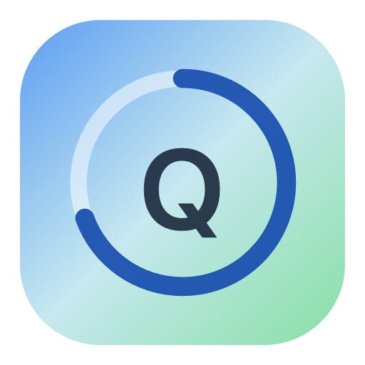

# Codex Quota

<p align="center">
  
</p>

<p align="center">
  一个注重隐私的原生 macOS 菜单栏应用与 WidgetKit 小组件，用于查看本机 Codex 额度。
</p>

<p align="center">
  <a href="README.md">English</a>
  ·
  <a href="https://github.com/Zamisku/Codex-Quota/actions/workflows/ci.yml"></a>
  
  
  <a href="LICENSE"></a>
</p>

<p align="center">
  
</p>

Codex Quota 读取 Codex Desktop 已有的本机登录状态，通过固定的 ChatGPT 兼容端点获取额度信息，再把不含令牌的脱敏快照共享给沙盒化的小组件扩展。访问令牌不会写入 App Group。

> [!IMPORTANT]
> Codex Quota 是非官方社区项目，与 OpenAI 没有隶属或背书关系。项目使用的是内部兼容端点，并非稳定的公开 API，接口可能随时变化。

## 功能亮点

- 原生 SwiftUI 菜单栏应用，提供 Small 和 Medium 两种 WidgetKit 小组件。
- 显示 5 小时额度、每周额度、重置时间、套餐和 reset credits（可用时）。
- 自动刷新，网络异常时保留近期快照并明确标记旧数据。
- 支持应用窗口、菜单栏和小组件深链手动刷新。
- 通过 `SMAppService` 可选启用登录时启动。
- Release 同时支持 `arm64` 与 `x86_64`。
- 不包含分析、遥测、Cookie、重定向或第三方跟踪。
- Widget Extension 启用沙盒，不能读取 `~/.codex`，也不能发起带认证的网络请求。

## 环境要求

- macOS 14 Sonoma 或更新版本
- Xcode 15 或更新版本
- [XcodeGen](https://github.com/yonaskolb/XcodeGen)
- 用于本机安装的 Apple Development 签名身份
- Codex Desktop 已登录，并存在 `${CODEX_HOME:-~/.codex}/auth.json`

## 快速开始

```bash
git clone git@github.com:Zamisku/Codex-Quota.git
cd Codex-Quota
brew install xcodegen
./scripts/build-install.sh
```

安装脚本会重新生成 Xcode 工程、运行测试、构建并校验 Universal Release、备份旧版本、清理重复的小组件注册、安装到 `/Applications/Codex Quota.app`，然后刷新 WidgetKit。

宿主应用显示“脱敏快照已共享”后：

1. 在桌面空白处按住 Control 点击。
2. 选择“编辑小组件”。
3. 搜索“Codex Quota”。
4. 添加 Small 或 Medium 尺寸。

## 代码签名

仓库当前配置使用开发团队 `X9MB8SQZHF` 和 App Group `X9MB8SQZHF.com.Zamisku.CodexQuota.shared`。使用其他 Apple Developer Team 时，需要同时修改：

- `project.yml` 中的 `DEVELOPMENT_TEAM` 与 Bundle ID
- 两个 entitlement 文件中的 App Group
- `Core/SharedSnapshotStore.swift` 中的 App Group 标识

修改后运行 `xcodegen generate`。完整开发流程见 [CONTRIBUTING.md](CONTRIBUTING.md)。

## 隐私边界

```text
~/.codex/auth.json
        │ 仅宿主应用读取
        ▼
chatgpt.com 上的固定 HTTPS 额度端点
        │ 解析并脱敏
        ▼
签名 App Group 中的 ProviderSnapshot
        │ 不含 token、账号 ID、提示词或原始响应
        ▼
沙盒化 WidgetKit Extension
```

宿主应用没有启用 App Sandbox，是因为沙盒进程无法直接读取本机 Codex 登录文件；小组件始终启用沙盒，只接收有大小边界的 Codable 快照。详细说明见 [docs/PRIVACY.md](docs/PRIVACY.md)。

## 项目结构

| 目录 | 职责 |
| --- | --- |
| `Codex-Quota/` | SwiftUI 宿主窗口、菜单栏、刷新循环和登录启动控制 |
| `CodexQuotaWidget/` | 沙盒化 Small/Medium WidgetKit 界面 |
| `Core/` | 登录读取、固定端点网络请求、防御性解析和共享模型 |
| `Codex-QuotaTests/` | 解析器与旧快照逻辑回归测试 |
| `project.yml` | XcodeGen 工程、Target、签名、Capability 与 Scheme 的源文件 |
| `scripts/build-install.sh` | 本机构建、验证、安装和小组件注册流程 |

架构细节见 [docs/ARCHITECTURE.md](docs/ARCHITECTURE.md)。

## 开发

生成工程：

```bash
xcodegen generate
```

运行不依赖签名、与 CI 一致的测试：

```bash
xcodebuild \
  -project Codex-Quota.xcodeproj \
  -scheme Codex-Quota \
  -configuration Debug \
  -destination 'platform=macOS' \
  -derivedDataPath .build/CI \
  CODE_SIGNING_ALLOWED=NO \
  test
```

需要本机签名的 Release 构建与安装时，运行 `./scripts/build-install.sh`。

## 已知限制

- 小组件刷新时间由 WidgetKit 调度，不能保证精确到某一分钟。
- 上游额度端点不是公开 API，响应字段可能改变。
- 仓库目前不发布经过公证的二进制文件；Apple Development 签名只适合本机开发安装。
- 截图只能验证可见布局，不能证明 VoiceOver、键盘和所有辅助功能设置均完全合规。

## 社区与支持

- 提交 PR 前请阅读 [CONTRIBUTING.md](CONTRIBUTING.md)。
- 可复现 Bug 与功能建议请使用 [GitHub Issues](https://github.com/Zamisku/Codex-Quota/issues)。
- 安全问题请按 [SECURITY.md](SECURITY.md) 私下报告。
- 支持范围与排查建议见 [SUPPORT.md](SUPPORT.md)。
- 版本变化记录在 [CHANGELOG.md](CHANGELOG.md)。

## 许可证

Codex Quota 使用 [Apache License 2.0](LICENSE)。版权声明见 [NOTICE](NOTICE)，第三方许可与致谢见 [THIRD_PARTY_NOTICES.md](THIRD_PARTY_NOTICES.md)。
